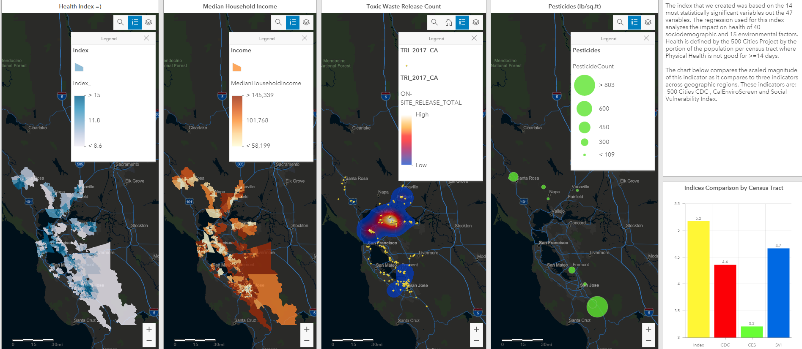
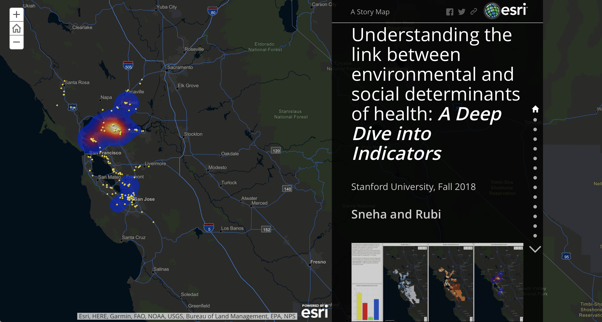

# CEE 224X Sustainable Urban Systems
## A9 FinalProject: _Understanding the link between environmental and social determinants of health: A Deep Dive into Indicators_

**Stanford University, Fall 2018**

**Team: Sneha & Rubi =)**

This repository contains:
- Final Report in **PDF** for our Project
    - Here link for Google Drive 
        - https://drive.google.com/open?id=1tWSQGecWmZfZt7XJz6giX9ewzbRoW-WKuYcoi7b4H5s
- **R code** used to run our Data Analysis which included:
    - EDA & CDA
         - Single & Multivariable Linear Regressions 
         - Forward Stepwise BIC
- **Excel** files used for our analysis and R code    
- Link to Google **Drive** for additional information
    - https://drive.google.com/open?id=1U-CXb-QWDrWhBE8wCPDU4QS9EQUiBIgp
- Link to **ArcGIS dashboard** created for this project which includes layers for:
    - Our Indicator
    - Median Household Income
    - Toxic Waste Releases
    - Pesticides Counts
    - https://arcg.is/0q5Knq
    

    
- Link to our **StoryMap** (Our Presentation) which includes interactive access to our ArcGIS Maps
    - https://arcg.is/1fOGne

